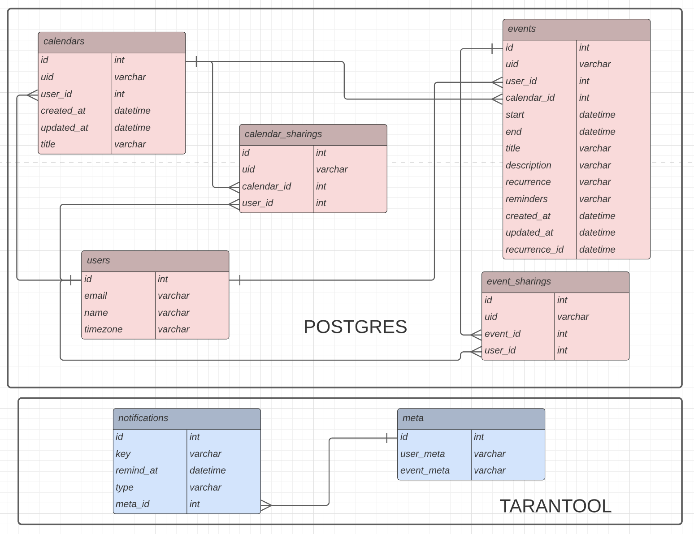

# 1. Тема и целевая аудитория
Google calendar

## MVP  
1) Создание календаря
2) Просмотр календаря
3) Создание и редактирование событий
5) Уведомления / напонимания на почту
6) Импорт публичных календарей

## Целевая аудитория  
Целевой аудиторией являются пользователи почтовой системы Google, планирующие свое расписание, а также пользователи, использующие календарь для встреч.

# 2. Расчет нагрузки  
## Продуктовые метрики
Ввиду отсутствия источников со статистикой использования google calendar, используем статистику mail calendar и экстраполируем ее на пользователей google.

Используем следующую статистику:  
DAU - 90k  
MAU - 1.5M  
Открытие календаря daily - 200k  
Открытие календаря monthly - 5M  
Открытие события daily - 60k  
Открытие события monthly - 1.5M  
Создание события daily - 10k  
Создание события monthly - 220k   
Подписка на внешние календари daily - 1550  
Просмотр событий внешних календарей daily - 300  

Пользователи почты mail.ru - 32.3 млн человек / месяц [1]
Проценты пользователей календаря 1.5М/45М = 5%
Пользователи gmail.com 1.8B/month [2]
1.8B * 5% = 90M пользователей календаря(месячная аудитория)
По пропорции с mail.ru calendar - 5.4M пользователей daily

* **Месячная аудитория**  
Месячная аудитория  = 90M

* **Дневная аудитория**  
Дневная аудитория = 5.4M

* **Средний размер хранилища пользователя**

    * ***Профиль пользователя***    
    Длина почтового адреса 99.9 персентиля не более 40 символов.[3]
    Рекомендуемая длина имени пользователя 70 символов.[4]
    Сгенерированный uid содержит 36 символов.
    Средняя длина названий таймзон - 20 символов.

    Итого: 
    Размер хранилища профиля = `1б * (40 + 70 + 20 + 36) + 32б = 198б` 
    * ***Календари пользователя***
    В среднем у пользователей не более 2ух личных календарей
    Сгенерированный uid содержит 36 символов.
    Пусть максимальная длина названия поля title 100 символов.
    Размер хранилища календарей = `(4б + 36б + 4б + 8б + 8б + 100б) * 2 = 320б`

    * ***Шаринги календарей***  
    В среднем 3-4 шаринга календарей
    Сгенерированный uid содержит 36 символов.
    Размер хранилища шарингов календарей = `(4б + 36б + 4б + 4б) * 4 = 192б`

    * ***События***  
    В среднем до 3000 событий у ползователя.
    Пусть максимальная длина названия поля title 200 символов.
    Пусть максимальная длина названия поля description 1000 символов.
    Размер хранилища событий = `(4б + 36б + 4б + 4б + 8б + 8б + 200б + 1000б + 100б + 100б + 8б + 8б + 8б) * 3000 = 4.3Mб`

    * ***Шаринги событий***  
    В среднем до 5000 шарингов событий.
    Размер хранилища шарингов событий = `(4б + 36б + 4б + 4б) * 5000 = 234Кб`

    * ***Напоминания/уведомления***
    У каждого события в среднем 2 напоминания (за n минут и в момент события) + 1 уведомление в момент создания события. Если у пользователя хранится до 3000 событий и (5000 - 3000) шарингов событий, в которых он не организатор, то на него приходится 10000 напониманий и 5000 уведомлений.
    key = calendar_uid + user_email + event_uid + recurrence_id
    длина(recurrence_id) = 16 символов
    длина(key) = длина(calendar_uid) + длина(user_email) + длина(event_uid) + длина(recurrence_id) + 3 * длина('/') = 36 + 40 + 36 + 16 + 3 = 131
    Метаинформация напоминаний/уведомлений = `(200б + 2000б) * 15000 = 31.5Мб`
    Размер хранилища напоминания/уведомлений = `(4б + 131б + 8б + 12б + 4б) * 15000 + 31.5Мб = 33.8Мб`
    Из них хранятся длительное время только напоминания (без метаинформации) = `(4б + 131б + 8б + 12б + 4б) * 10000 = 1.5Мб`

* **Среднее количество действий пользователя по типам в день**  

|**Тип действия**               |**Частота**|
|-------------------------------|-----------|
|просмотр календаря             |4 / день   |
|открытие события               |1  / день  |
|создание события               |1 / неделя |
|редактирование события         |1 / неделя |       |

Исходя из статистики, в среднем пользователь проверяет календарь 4 раза / день. 
Пользователь в среднем создает 1 событие в неделю (4 в месяц).

## Технические метрики
* **Размер хранения в разбивке по типам данных**
    * ***Профили пользователей***    
    `198б * 1.8млрд = 332 Гб`

    * ***Календари пользователей***  
    `320б * 1.8млрд = 536.4 Гб`

    * ***Шаринги календарей***  
    `192б * 54млн = 9.7Гб`

    * ***События***  
    `4.3кб * 54млн = 221.4Тб`

     * ***Шаринги событий*** 
    `234Кб * 54млн = 11.8Тб` 

* **Сетевой трафик** 
* ***Пиковое потребление в течении суток (в Гбит/с)***  
Пиковое число запросов приходится на 9 - 10 часов утра. В основном пользователи просматривают свой календарь.
Пусть в календаре каждый день в среднем 5 событий. События подгружаются по неделям. 
Итого 35 событий / просмотр календаря.
Итого пиковый трафик: `5.4M * (198б + 320б + 4.3Мб * 35) / 3600 = 1763 Гбит/с`

* ***Суммарное потребление в течении суток (в Гбайт/сутки)***  
Просмотр календаря: `5.4M * (198б + 320б + 4.3Мб * 35) * 4 = 3.1М Гбайт/сутки`  
Нотификации: `5.4M * (4б + 131б + 8б + 12б + 4б + 200б + 2000б) * 35 * 4 * 3 = 5k Гбайт/сутки` 

* **RPS в разбивке по типам запросов (запросов в секунду)**  
Исходя из среднего количества действий пользователя по типам в день, посчитаем rps в разбивке по типам запросов. 

1. Просмотр календаря.  
При этом происходят запросы на получение календаря, событий, данных пользователя.
Итого: `(4 + 35 + 1) * 5.4M / (24 * 3600) = 2500 RPS`  

2. Создание событий  
Исходя из статистики, пользователь создает 1 событие в неделю (4 в месяц).
То есть 360000 событий / день. 
То есть `(360000) / (24 * 3600) = 4 RPS`  
Пусть в среднем у пользователя активных 5 повторяющихся событий (включая те, где он участник). 
Тогда каждый день будут 5 дополнительных запросов на бекенд сервера (если предположить, что события повторяются каждый день). То есть дополнительно `(5.4М * 5) / (24 * 3600) = 313 RPS` 
Итого суммарно `317 RPS`  

3. Открытие событий
Исходя из статистики, 2160000 / день.
Итого `(2160000) / (24 * 3600) = 25 RPS`  

4. Получение уведомлений/напоминаний.  
 95% всех событий - без дополнительных участников. Пусть события с участниками имеют в среднем 3 участника. Итого, если в день 7920000 событий, то 7524000 уведомлений и напоминаний только для организатора + 396000 уведомлений и напоминаний для 3 участников. 
Итого `(7524000 * 2 + 7524000 + 396000 * 3 * 2 + 396000 * 3) / (24 * 3600) = 302 RPS` в сервис напоминаний.

## 3. Логическая схема

### Пояснение к логической схеме
calendars - календари пользователей  
calendar_sharings - реплики публичных календарей у пользователей   
events - события пользователей  
event_sharings - реплики событий у участников событий  
users - пользователи   
notifictions - напоминания / уведомления  
meta - метаинформация напоминаний/ уведомлений  

## 4.  Физическая схема

### Пояснение к физической схеме
Для хранения данных о пользователях, их календарях и событиях предлагается использовать СУБД Postgres, так как Postgres хранит данные на диске(они не пропадут при отключении источника питания), имеет мощный механизм репликации и является наиболее популярной реляционной СУБД у разработчиков. Необходимо шардировать БД по пользователям, чтобы ускорить запросы в БД. В качестве ключа шардирования можно выбрать сгенерированный uid пользователя - тогда можно подобрать хеш-функцию, которая будет равномерно распределять пользователей по шардам. Так как большинство пользователей почты не пользуется календарем (54 млн активных пользователей из 1.8 млрд пользователей почты), то можно данные о неактивных пользователях и их календари хранить в отдельной БД, запросы в которую будут идти очень редко. 
Когда неактивный пользователь создаст первое событие, для него генерируется uid и он переносится на один из шардов активных пользователей. Лучше всего использовать виртуальные шарды: разбить всех пользователей на 54 виртуальные шарда (по 1M пользователей на шарде) и маппить шарды на реальные сервера.

Индексы:  
calendars - user_id, uid  
calendar_sharings - user_id+calendar_id, uid  
events - user_id+calendar_id, user_id, calendar_id, uid  
event_sharings - user_id+event_id, uid  
users - email, uid  

Для хранения напоминаний и уведомлений можно использовать СУБД Tarantool. Tarantool хранит все данные в оперативной памяти и способен отдавать информацию быстрее реляционных СУБД. Также Tarantool имеет возможность шардирования и репликации. Шардирование напоминаний производится по ключу напоминания  
(key = calendar_uid + user_email + event_uid + recurrence_id)
 

## 5. Технологии

|**Технология**          |**Область применения**                       |**Мотивационная часть**|
|------------------------|---------------------------------------------|-----------------------|
|Go                      |Сервисы calendarapi, notifyapi, email_pusher |Поддержка конкурентности, большая скорость разработки, легко поддерживать код|
|Postgresql              |DB1(основное хранилище данных)               |Надежность, репликация, популярность среди специалистов|
|Tarantool               |DB2(хранение данных напоминаний)             |Производительность, удобное шардирование|

## 6. Схема проекта

Проект имеет микросервисную архитектуру. Состоит из трех микросервисов.  
Основной сервис calendarapi отвечает на все запросы пользователей.  
Запросы проксируются и балансируются через nginx. Calendarapi общается с основным хранилищем данных 
db1 (Postgresql) и с сервисом нотификаций по grpc. 

Сервис нотификаций notifyapi используется для немедленного отправления уведомлений о создании/ редактировании/приглашении в событие на почту пользователям, а также для отправки напоминаний о событии на почту. Сервис нотификаций обращается к calendarapi для получения информации о напоминании (на основе которой конструируется html с напоминанием).  Notifyapi хранит уведомления и напоминания в db2(Tarantool). Calendarapi отсылает notifyapi уведомления, которые затем кладутся в очередь db2 и сразу же вытягиваются демоном, который обрабатывает очередь нотификаций (если демон вытаскивает события по полю remind_at, то у уведомлений оно равно 0). Затем уведомления посылаются сервису email_pusher, который конструирует html и отправляет уведомление на почту. 
Напоминания также кладутся в db2, но хранятся там столько, сколько установлено в remind_at. Поэтому передавать всю метаинформацию о напоминаниях неправильно, так как это может раздуть db2. Особенно если учесть, что число приемников напониманий может возрасти (смс, соц сети и т.д.). Поэтому в напоминании можно передавать ключ, содержащий информацию о том, в какому конкретно событию относится напоминание.  
Демон notifyapi забирает напоминание из db2 и делает запрос в calendarapi за всей метаинформацией, необходимой для создания и отправки напоминания, и затем также отправляет его в email_pusher.

Email_pusher - сервис для отправки уведомлений / напоминаний в электронную почту пользователей. Он конструирует html с уведомлением / напоминанием и прикрепляет его в письме.

**Балансировка нагрузки**  
Распределение пользователей календаря по странам можно косвенно получить из распределения пользователей
гугл почты по странам[5]. Необходимо учитывать, что в столицах и крупных городах пользователей календаря гораздо больше, так как в больших городах находится основная часть бизнес-центров + университетов, а офисные работники и студенты - основные пользователи календаря.

***Балансировка фронтендов***  
Для быстрой доступности сервиса для всех пользователей, необходимо распределить фронтенд сервера по
областям пользования. Для того, чтобы распределять пользователей на ближайшие сервера, используется
geoDNS.  

 

ip-адреса фронтенд серверов записываются в A-запись DNS серверов. Например, DNS-сервер, обслуживающий зону ru перенаправит запрос на фронтенд-сервер, расположенный в России, а DNS-сервер, обслуживающий Америку перенаправит запрос на фронтенд-сервер, расопложенный в США.
Также для отказоустойчивости необходимо использовать несколько фронтенд серверов в каждой локации, а нагрузка на них балансируется по принципу round-robin с помощью нескольких A-записей DNS-сервера для однго домена. Необходимо выставить невысокий  ttl, чтобы если один из серверов упадет, то через короткий промежуток времени запросы перестали балансироваться на него. С учетом небольших rps, это не должно привести к перегрузке оставшихся реплик.  

***Балансировка бекендов***  
Для отказоустойчивости бекенд-серверов также используется принцип избыточности: существует несколько реплик бекенд-серверов в каждой локации. Балансировка на бекенды осуществляется с помощью nginx, настроенного как L7 балансировщик. Работает по принципу round-robin. 

## 7. Список серверов  
Исходя из статистики пользователей гугл почты по странам [5], можно получить картину распределения пользователей календаря по странам.  
|**Страна**        |**Пользователи, %**|
|------------------|------|
|США               |16.4  |
|Италия            |2.4   |
|Германия          |5     |
|Россия            |1.2   |
|Англия            |4.4   |
|Индия             |15.8  |
|Южная Африка      |2.3   |
|Франция           |2.4   |
|Испания           |2.6   |
|Аргентина         |2.1   |
|Бразилия          |10    |
|Чили              |1.5   | 
|Саудовская Авария |1.6   | 
|Канада            |1.4   | 
|Австралия         |9.8   | 
|Нидерланды        |0.5   | 
|Мексика           |5.3   | 
|Япония            |4     | 
|Швеция            |0.4   | 
|Новая Зеландия    |0.25  | 
|Колумбия          |2     | 
|Дания             |0.2   | 
|Индонезия         |16.5  | 
|Бельгия           |0.5   | 
|Швейцария         |0.3   |

Выделим распределение по пользователям на материках и отдаленных локациях:
Северная Америка 23.1 %  
Южная Америка 15.6 %  
Южная Африка 2.3 %  
Россия 1.2 %  
Индия 15.8 %  
Индонезия 16.5 %  
Европа 18.7 %  
Австралия 10 %  
Саудовская Аравия 1.6 %  

В этих локациях можно устанавливать сервера (как фронтенд, так и бекенд)  
**Фронтенд**
***NGINX***  
В среднем NGINX выдает 300 RPS на 1 ядро. Покажем расчет на примере Южная Америка. Пусть в этом регионе календарем пользуются `5.4M * 0.156 = 0.82M` пользователей. Пиковый RPS достигается утром в 9-10 часов, когда пользователи смотрят расписание на день: `0.82M * (1 + 1 + 35) / 3600 = 8427 RPS` 
Итого необходимо: `8427 RPS / 300 RPS = 28 ядер`. Достаточно одного 32 ядерного сервера в столице Бразилии, так как там больше всего пользователей. + 2 сервера-реплики для балансировки и отказоустройчивости.

|**Локация**       |**Расположение**|**CPU (ядер) |	RAM (ГБ)  |	Диск(Гб)|	Количество, %**|
|------------------|----------------|-------------|-----------|---------|------------------|
|Южная Америка     |Бразилиа        |32           |64         |SSD 64   |3                 |
|Северная Америка  |Нью-Йорк        |32           |64         |SSD 64   |3                 |
|Северная Америка  |Нью-Мексико     |32           |64         |SSD 64   |3                 |
|Южная Африка      |Кейптаун        |4            |64         |SSD 64   |3                 |
|Россия            |Москва          |4            |64         |SSD 64   |3                 |
|Индия             |Дели            |32           |64         |SSD 64   |3                 |
|Индонезия         |Джакарта        |32           |64         |SSD 64   |3                 |
|Европа            |Берлин          |32           |64         |SSD 64   |3                 |
|Европа            |Лондон          |32           |64         |SSD 64   |3                 |
|Австралия         |Сидней          |32           |64         |SSD 64   |3                 |
|Саудовская Аравия |Эр-Рияд         |4            |64         |SSD 64   |3                 |

**Бекенд**  
***calendarapi***   
Сервис calendarapi получает от фронтенд-серверов запросы на создание/просмотр календаря, создание/просмотр/редактирование событий, импорт публичных календарей, а также запросы от сервиса notifyapi на получение данных о нотификациях. Аналогичну расчету фронтенд серверов, выберем сервера, исходя из пиковой нагрузки:  

|**Локация**       |**Расположение**|**CPU (ядер) |	RAM (ГБ)  |	Диск(Гб)|	Количество, %**|
|------------------|----------------|-------------|-----------|---------|------------------|
|Южная Америка     |Бразилиа        |32           |64         |SSD 64   |3                 |
|Северная Америка  |Нью-Йорк        |32           |64         |SSD 64   |3                 |
|Северная Америка  |Нью-Мексико     |32           |64         |SSD 64   |3                 |
|Южная Африка      |Кейптаун        |4            |64         |SSD 64   |3                 |
|Россия            |Москва          |4            |64         |SSD 64   |3                 |
|Индия             |Дели            |32           |64         |SSD 64   |3                 |
|Индонезия         |Джакарта        |32           |64         |SSD 64   |3                 |
|Европа            |Берлин          |32           |64         |SSD 64   |3                 |
|Европа            |Лондон          |32           |64         |SSD 64   |3                 |
|Австралия         |Сидней          |32           |64         |SSD 64   |3                 |
|Саудовская Аравия |Эр-Рияд         |4            |64         |SSD 64   |3                 |

***notifyapi***  
Сервис notifyapi получает от calendarapi нотификации. С учетом низкого на сервис RPS можно использовать везде 4 ядерные сервера.  Количество и расположение серверов аналогично предыдущему пункту.

***email_pusher***  
Аналогично предыдущему пункту.

***db1***  
Размер базы данных около 234Тб. Используем сервера с объемом памяти 32Тб. Учитывая что на каждый репликасет необходимо 3 сервера + оставить память под индексы, пусть для хранения данных в каждой локации используются 25 серверов с размером диска 32Тб.  
Если в сервис calendarapi приходит около 3000 RPS, то в базу данных пусть в худшем случае приходит 30000 RPS. С учетом шардирования и репликации postgresql должен справиться с такой нагрузкой.  

|**CPU (ядер) |	RAM (ГБ)  |	Диск(Тб)|	Количество, %**|
|-------------|-----------|---------|------------------|
|64            |32         |32       |25               |

***db2***  
Размер базы данных около 8Тб. Необходимы сервера с большим объемом оперативной памяти.
|**CPU (ядер) |	RAM (ГБ)  |	Диск(Гб)|	Количество, %**|
|-------------|-----------|---------|------------------|
|8            |256        |32       |100               |

## Список использованных источников
1. https://journal.open-broker.ru/visit-card/mail-ru-group/
2. https://findstack.com/gmail-statistics/#:~:text=Gmail%20has%20over%201.8%20billion%20active%20users&text=Many%20of%20these%20customers%20access%20their%20inbox%20every%20day
3. https://www.freshaddress.com/blog/long-email-addresses/#:~:text=So%20over%20the%20last%20few,show%20at%20least%2031%20characters
4. https://stackoverflow.com/questions/30485/what-is-a-reasonable-length-limit-on-person-name-fields
5. https://financesonline.com/number-of-active-gmail-users/

