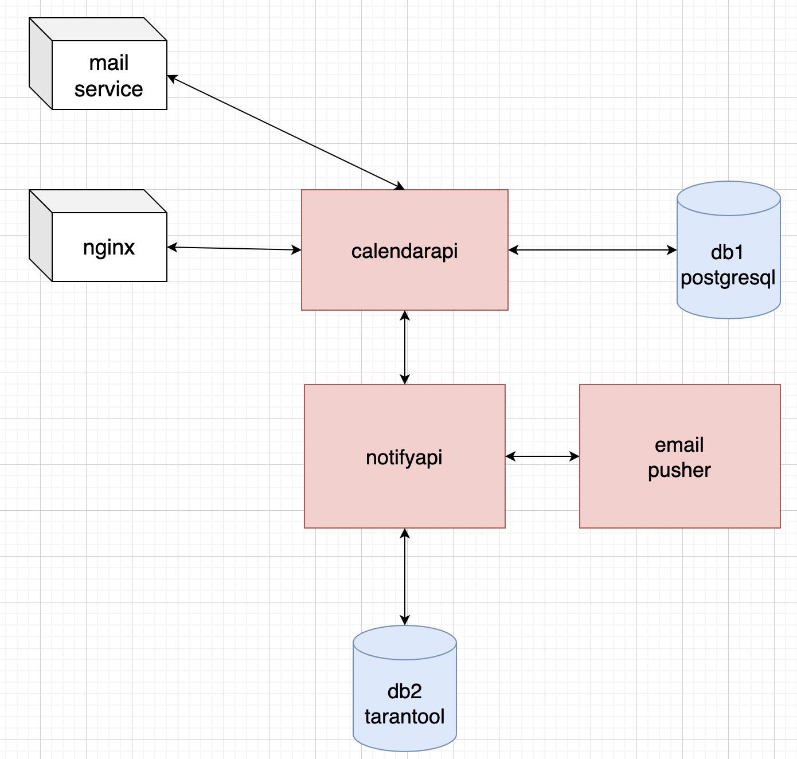

# 1. Тема и целевая аудитория
Календарь
## MVP
1) Создание календаря
2) Просмотр календаря
3) Создание и редактирование событий
5) Уведомления / напонимания на почту
6) Импорт публичных календарей

## Целевая аудитория  
Целевой аудиторией являются пользователи почтовой системы Google, планирующие свое расписание, а также пользователи, использующие календарь для встреч.

# 2. Расчет нагрузки  
## Продуктовые метрики
Ввиду отсутствия источников со статистикой использования  google calendar, используем статистику vk calendar и экстраполируем ее на пользователей google.

Используем следующую статистику:
DAU - 90k
MAU - 1.5M
Открытие календаря daily - 200k
Открытие календаря monthly - 5M
Открытие события daily - 60k
Открытие события monthly - 1.5M
Создание события daily - 10k
Создание события monthly - 220k 
Подписка на внешние календари daily - 1550
Просмотр событий внешних календарей daily - 300

Пользователи почты mail - 32.3 млн человек / месяц [1]
Проценты пользователей календаря 1.5М/45М = 5%
Пользователи gmail 1.8B/month [2]
1.8B * 5% = 90M пользователей календаря(месячная аудитория)
По пропорции с mail calendar - 5.4M пользователей daily

* **Месячная аудитория**  
Месячная аудитория  = 90M

* **Дневная аудитория**  
Дневная аудитория = 5.4M

* **Средний размер хранилища пользователя**

    * ***Профиль пользователя***    
    Длина почтового адреса 99.9 персентиля не более 40 символов.[3]
    Рекомендуемая длина имени пользователя 70 символов.[4]
    Средняя длина названий таймзон - 20 символов.

    Итого: 
    Метаинформация профиля = `1б * (40 + 70 + 20) + 32б = 162б` 
    * ***Календари пользователя***
    В среднем у пользователей не более 2ух личных календарей
    Сгенерированный uid содержит 36 символов.
    Метаинформация календарей = `(4б + 36б + 4б + 8б + 8б) * 2 = 120б`

    * ***Шаринги календарей***  
    В среднем 3-4 шаринга календарей
    Сгенерированный uid содержит 36 символов.
    Метаинформация шарингов календарей = `(4б + 36б + 4б + 4б) * 4 = 192б`

    * ***События***  
    В среднем до 3000 событий.
    Метаинформация событий = `(4б + 36б + 4б + 4б + 8б + 8б + 100б + 100б + 8б + 8б) * 3000 = 820Кб`

    * ***Шаринги событий***  
    В среднем до 5000 шарингов событий.
    Метаинформация шарингов событий = `(4б + 36б + 4б + 4б) * 5000 = 234Кб`

* **Среднее количество действий пользователя по типам в день**  

|**Тип действия**               |**Частота**|
|-------------------------------|-----------|
|открытие календаря             |10         |
|открытие события               |5          |
|создание события               |1          |
|редактирование события         |1          |

## Технические метрики
* **Размер хранения в разбивке по типам данных**
    * ***Профили пользователей***  
    Пусть 162б на профиль(метаинформация)
    Итого: `162б * 1.8млрд = 271.5 Гб`

    * ***Календари пользователей***  
    `120б * 1.8млрд = 201 Гб`

    * ***Шаринги календарей***  
    `192б * 54млн = 9.7Гб`

    * ***События***  
    `820кб * 54млн = 41.2Тб`

     * ***Шаринги событий*** 
    `234Кб * 54млн = 11.8Тб` 

* **Сетевой трафик** 
* ***Пиковое потребление в течении суток (в Гбит/с)***  
Пиковое число запросов приходится на 10 - 11 часов утра. В основном пользователи просматривают свой календарь. В vk calendar 200k rps:
Пиковый rps: `(54M / 1.5M) * 200k = 7.2M rps`
Пусть в календаре каждый день в среднем 5 событий. События подгружаются по неделям. 
Итого 35 событий / просмотр календаря.
Итого пиковый трафик: ` 7.2M * (162б + 120б + 820Кб * 35) = 1.5M Гбит/c`

* ***Суммарное потребление в течении суток (в Гбайт/сутки)***  
Среднесуточный rps: `(54M / 1.5M) * 145k = 5.2M rps`
Итого суммарный трафик: `5.2M * (162б + 120б + 820Кб * 35) * 3600 * 24 = 12.3 * 10^9 Гбайт/cутки`

* **RPS в разбивке по типам запросов (запросов в секунду)**  

Исходя из среднего количества действий пользователя по типам в день, посчитаем rps в разбивке по типам запросов. 

1. Просмотр календаря.  
При этом происходят запросы на получение календаря, событий, данных пользователя.
Итого: `(10 * 3.24M * 3) / (24 * 3600) = 1125 RPS`  

2. Создание событий  
Исходя из статистики, пользователь создает 1 событие в неделю (4 в месяц).
Итого 360000 событий / день. 
Итого `(360000) / (24 * 3600) = 4 RPS`  

3. Открытие событий
Исходя из статистики, 2160000 / день.
Итого `(2160000) / (24 * 3600) = 25 RPS`  

4. Получение уведомлений/напоминаний.  
У каждого события в среднем 2 напоминания (за n минут и в момент события) + 1 уведомление в момент создания события. 95 всех событий - без дополнительных участников. Пусть события с участниками имеют в среднем 3 участника. Итого, если в день 7920000 событий, то 7524000 уведомлений и напоминаний только для организатора + 396000 уведомлений и напоминаний для 3 участников. 
Итого `(7524000 * 2 + 7524000 + 396000 * 3 * 2 + 396000 * 3) / (24 * 3600) = 302 RPS` в сервис напоминаний.

## 3. Логическая схема

### Пояснение к логической схеме
calendars - календари пользователей 
calendar_sharings - реплики публичных календарей у пользователей  
events - события пользователей 
event_sharings - реплики событий у участников событий
users - пользователи  

## 4.  Физическая схема

### Пояснение к физической схеме
Для хранения данных о пользователях, их календарях и событиях предлагается использовать СУБД Postgres, так как Postgres хранит данные на диске(они не пропадут при отключении источника питания), имеет мощный механизм репликации и является наиболее популярной реляционной СУБД у разработчиков. Необходимо шардировать БД по пользователям, чтобы ускорить запросы в БД. В качестве ключа шардирования можно выбрать сгенерированный uid пользователя - тогда можно подобрать хеш-функцию, которая будет равномерно распределять пользователей по шардам. Так как большинство пользователей почты не пользуется календарем (54 млн активных пользователей из 1.8 млрд пользователей почты), то можно данные о неактивных пользователях и их календари хранить в отдельной БД, запросы в которую будут идти очень редко. 
Когда неактивный пользователь создаст первое событие, для него генерируется uid и он переносится на один из шардов активных пользователей. Лучше всего использовать виртуальные шарды: разбить всех пользователей на 54 виртуальные шарда (по 1M пользователей на шарде) и маппить шарды на реальные сервера.

Индексы:
calendars - user_id, uid  
calendar_sharings - user_id+calendar_id, uid  
events - user_id+calendar_id, user_id, calendar_id, uid  
event_sharings - user_id+event_id, uid  
users - email, uid  

Для хранения напоминаний и уведомлений можно использовать СУБД Tarantool. Tarantool хранит все данные в оперативной памяти и способен отдавать информацию быстрее реляционных СУБД. Также Tarantool имеет возможность шардирования и репликации. Шардирование напоминаний производится по ключу напоминания  
(key = calendar_uid + user_email + event_uid + recurrence_id)
 

## 5. Технологии

|**Технология**          |**Область применения**                       |**Мотивационная часть**|
|------------------------|---------------------------------------------|-----------------------|
|Go                      |Сервисы calendarapi, notifyapi, email_pusher |Поддержка конкурентности, большая скорость разработки, легко поддерживать код|
|Postgresql              |DB1(основное хранилище данных)               |Надежность, репликация, популярность среди специалистов|
|Tarantool               |DB2(хранение данных напоминаний)             |Производительность, удобное шардирование|

## 6. Схема проекта

Проект имеет микросервисную архитектуру. Состоит из трех микросервисов.  
Основной сервис calendarapi отвечает на все запросы пользователей.  
Запросы проксируются и балансируются через nginx. Calendarapi общается с основным хранилищем данных 
db1 (Postgresql) и с сервисом нотификаций по grpc. 

Сервис нотификаций notifyapi используется для немедленного отправления уведомлений о создании/ редактировании/приглашении в событие на почту пользователям, а также для отправки напоминаний о событии на почту. Сервис нотификаций обращается к calendarapi для получения информации о напоминании (на основе которой конструируется html с напоминанием).  Notifyapi хранит уведомления и напоминания в db2(Tarantool). Calendarapi отсылает notifyapi уведомления, которые затем кладутся в очередь db2 и сразу же вытягиваются демоном, который обрабатывает очередь нотификаций (если демон вытаскивает события по полю remind_at, то у уведомлений оно равно 0). Затем уведомления посылаются сервису email_pusher, который конструирует html и отправляет уведомление на почту. 
Напоминания также кладутся в db2, но хранятся там столько, сколько установлено в remind_at. Поэтому передавать всю метаинформацию о напоминаниях неправильно, так как это может раздуть db2. Особенно если учесть, что число приемников напониманий может возрасти (смс, соц сети и т.д.). Поэтому в напоминании можно передавать ключ, содержащий информацию о том, в какому конкретно событию относится напоминание.  
Демон notifyapi забирает напоминание из db2 и делает запрос в calendarapi за всей метаинформацией, необходимой для создания и отправки напоминания, и затем также отправляет его в email_pusher.

Email_pusher - сервис для отправки уведомлений / напоминаний в электронную почту пользователей. Он конструирует html с уведомлением / напоминанием и прикрепляет его в письме.

## Список использованных источников
1. https://journal.open-broker.ru/visit-card/mail-ru-group/
2. https://findstack.com/gmail-statistics/#:~:text=Gmail%20has%20over%201.8%20billion%20active%20users&text=Many%20of%20these%20customers%20access%20their%20inbox%20every%20day
3. https://www.freshaddress.com/blog/long-email-addresses/#:~:text=So%20over%20the%20last%20few,show%20at%20least%2031%20characters
4. https://stackoverflow.com/questions/30485/what-is-a-reasonable-length-limit-on-person-name-fields

